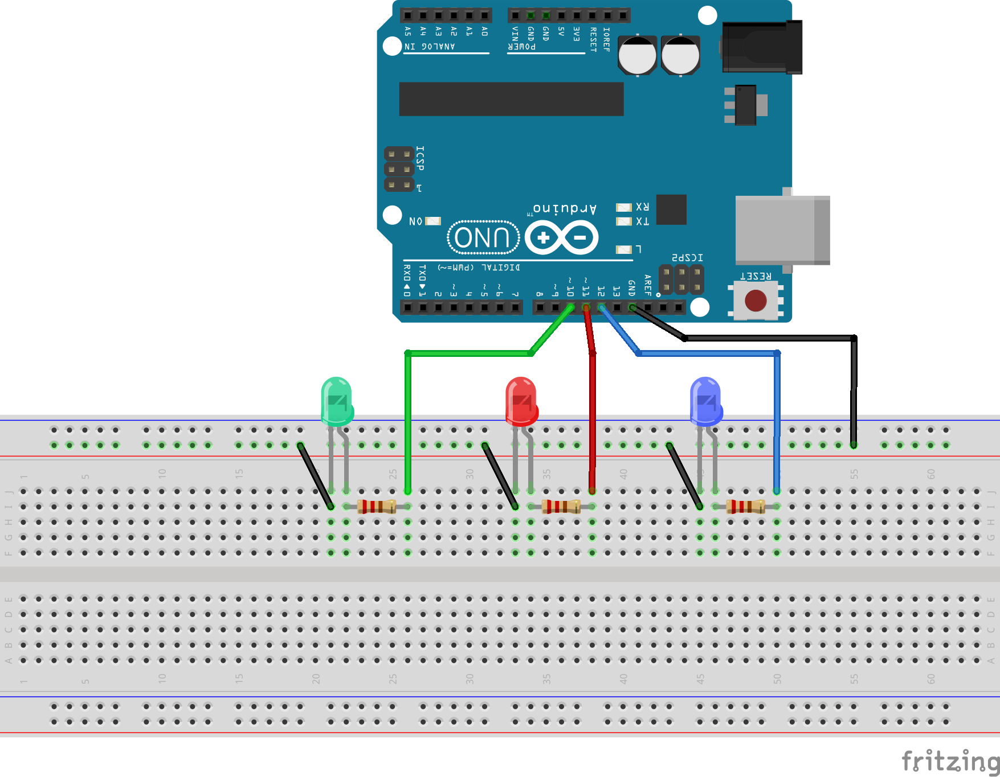
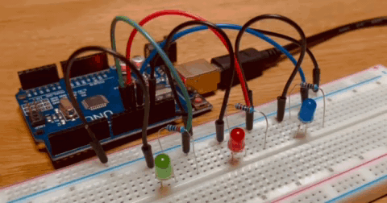

#link: 

# 3 Blinks

Make 3 LEDs blink in sequence e.g. 2 times the blue, 1 time the red, then 3 times the green. Design and build the circuit, write the Arduino software and run it.

(Homework exercise proposed in Lesson 3 of Arduino Tutorials #3. See the [video](https://www.youtube.com/watch?v=CfdaJ4z4u4w&list=PLGs0VKk2DiYw-L-RibttcvK-WBZm8WLEP&index=3 ) and [blog post](https://toptechboy.com/arduino-tutorial-3-understanding-how-breadboards-work/) for details)

 

# Tags

#tags: 
- [ ] basics
- [ ] algorithms
- [ ] data_structures: trees, graphs
- [ ] strings: regex
- [ ] dates_times: timezones
- [ ] file_management: input, output, folders and files
- [ ] testing
- [ ] exceptions
- [ ] logging
- [ ] object_oriented_programming
- [ ] GUI
- [ ] plotting_data
- [ ] CLI
- [x] arduino
- [ ] ROS
- [ ] chatGPT
- [ ] databases
- [ ] API
- [ ] web_scraping
- [ ] OpenCV