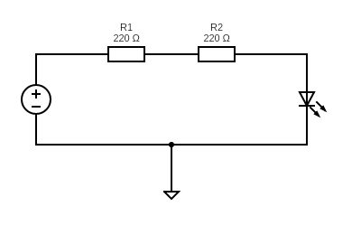
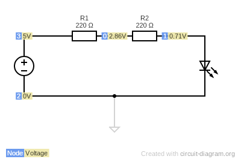
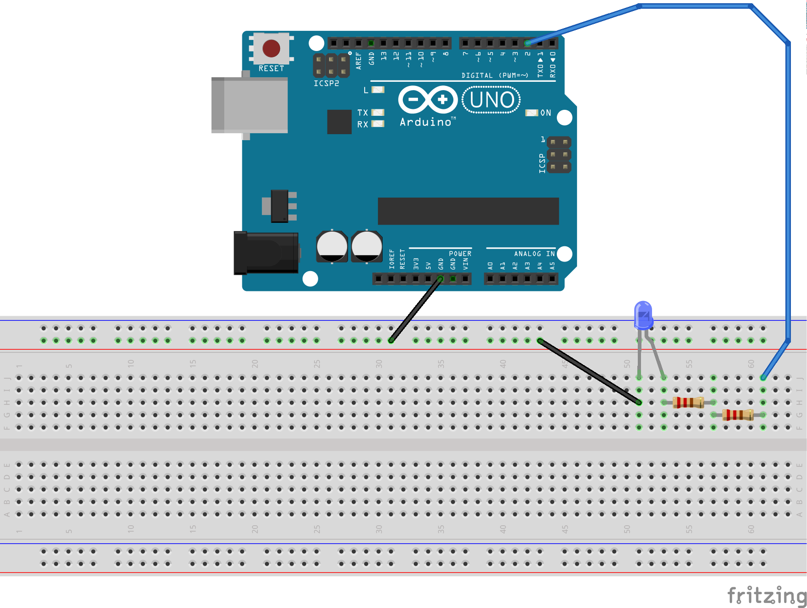
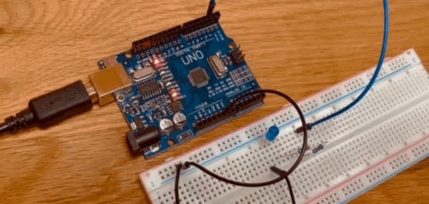

#link: 

# Arduino Tutorials (by Paul McWhorter)

Full playlist: https://www.youtube.com/playlist?list=PLGs0VKk2DiYw-L-RibttcvK-WBZm8WLEP

## Set up

* Install Arduino IDE: https://www.arduino.cc/en/software

* Connect Arduino to the computer through USB cable and set properly Board, Port and Programmer

Tools -> Board -> Arduino Uno
Tools -> Port -> /dev/tty/USB0
Tools -> Programmer -> AVRISP mkII


Find boilerplate for Arduino code in:
File -> Examples -> 01. Basics -> Bare Minimum

```c++
void setup() {
  // setup code here, runs once when you power the board or press the reset button

}

void loop() {
  // main code here, the loop runs over and over again forever

}
```
## Writing Arduino code from vscode using the Arduino extension

* Install *Visual Studio Code extension for Arduino* (search for Arduino in the marketplace or 
`Ctrl + Shift + P` to open command palette, type `Extensions:Install Extension` then type `vscode-arduino`)

* My notes on configuration and usage of the extension can be found here: https://github.com/mhered/manolobot/blob/main/Part-3-manolobot-Nov22.md

* The extension saves configuration in a file `./vscode/arduino.json`:

```json
{
    "sketch": "code/Day022_17-04-23/Arduino101/Arduino101.ino",
    "board": "arduino:avr:uno",
    "port": "/dev/ttyUSB0"
}
```


* There is a warning that support for legacy IDE will stop soon, encouraging to move to Arduino CLI instead. However with the CLI it seems it only works if the sketch file`*.ino` is named the same as the folder (??)

## Lesson 1: Blinking LED
```C++
void setup()
{
  // setup code here, runs once when you power the board or press the reset button
  // initialize digital pin 13 (which is wired to the builtin LED) as an output.
  pinMode(13, OUTPUT);
}

void loop()
{
  // main code here, the loop runs over and over again forever
  int T_MS = 100;

  digitalWrite(13, HIGH); // send HIGH voltage level to pin 13 to turn the LED on
  delay(T_MS);            // wait for T_MS milliseconds
  digitalWrite(13, LOW);  // send LOW voltage level to pin 13 to turn the LED off
  delay(9*T_MS);            // wait for T_MS milliseconds
}
```


## Lesson 2: LEDs (Light emitting diodes)
Long leg of diode is P-type material, connect to +
Short leg is N-type, connect to -
If you reverse polarity they do not conduct (and do not light up)
Need a current limiting resistor in series otherwise you'll burn the LED. Usually 220 Ohms
Color of LED is fundamental property of the material: it depends on the band energy gap = h x freq  - where h is Planck's constant and freq determines the color (high f is violets, UV, low f is reds , IRs)

Circuit created online with https://www.circuit-diagram.org/editor/





Source file: [circuit.cddx](./circuit-diagram/circuit.cddx) 

## Lesson 3: Breadboards

(See also this great tutorial on breadboards by adafruit: https://learn.adafruit.com/breadboards-for-beginners?view=all)

Using [Fritzing](https://fritzing.org/) to create a diagram:

* Installation: (https://installati.one/install-fritzing-ubuntu-20-04/):

```bash
$ sudo apt-get update
$ sudo apt-get upgrade
$ sudo apt-get -y install fritzing
```

* Basic tutorial: https://fritzing.org/learning/tutorials/building-circuit
* Result: 

  * Source file: [blinking_led.fzz](./fritzing/blinking_led.fzz)
* automatically generated [bill of materials](./fritzing/blinking_led_bom.html)



Circuit:



# Tags

#tags: 
- [ ] basics
- [ ] algorithms
- [ ] data_structures: trees, graphs
- [ ] strings: regex
- [ ] dates_times: timezones
- [ ] file_management: input, output, folders and files
- [ ] testing
- [ ] exceptions
- [ ] logging
- [ ] object_oriented_programming
- [ ] GUI
- [ ] plotting_data
- [ ] CLI
- [x] arduino
- [ ] ROS
- [ ] chatGPT
- [ ] databases
- [ ] API
- [ ] web_scraping
- [ ] OpenCV