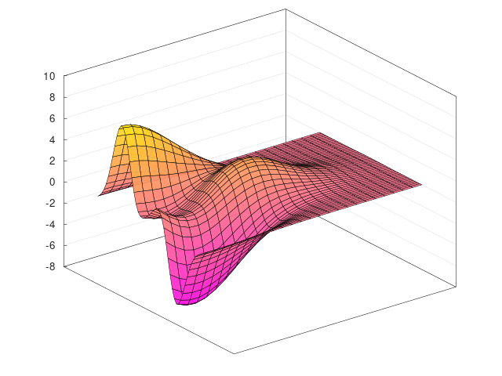
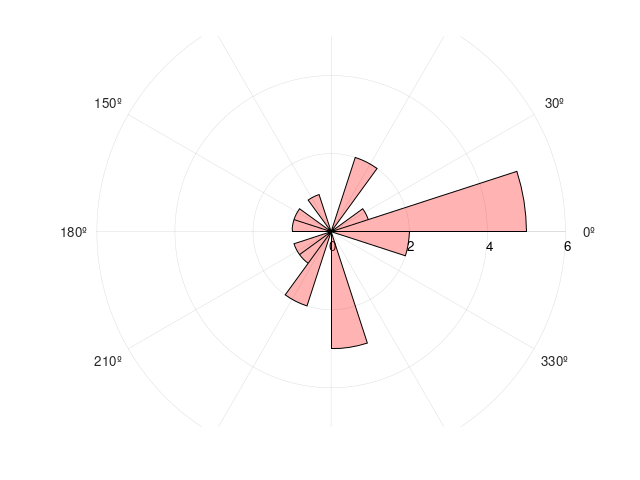
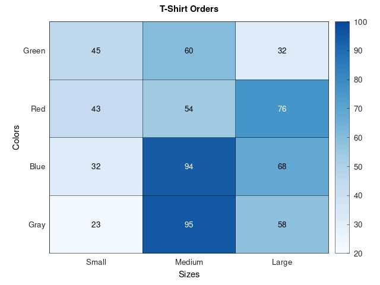

#link:  https://github.com/alandefreitas/matplotplusplus


# Plotting data with C++ (2)

Top recommendations after some googling (e.g. https://stackoverflow.com/questions/4283731/plotting-package-for-c or https://stackoverflow.com/questions/63667255/plotting-graphs-in-c#63667672):

- [ ] [GNU plot](http://www.gnuplot.info/): is a CLI, and there is a [gnuplot-iostream wrapper]( http://stahlke.org/dan/gnuplot-iostream/). Seems old and steep learning curve. 
- [x] [Sciplot](https://sciplot.github.io/): seems to be another wrapper for GNUplot, requires installing GNUplot then a header file. Beautiful and simple syntax
- [ ] [Matplotlib](https://github.com/lava/matplotlib-cpp): a C++ wrapper for the popular python package matplotlib. Requires python etc but then only needs to include a header file
- [ ] [Koolplot](http://koolplot.codecutter.org/): supposed to be very simple but limited
- [ ] CERN's [ROOT](https://root.cern/): A C++ library to plot graphs. Also seems to be a CLI... 
- [x] [Matplot++](https://alandefreitas.github.io/matplotplusplus/): looks super complete and cool. This article makes a comparison to alternatives and sells Matplot++ well: https://alandefreitas.github.io/matplotplusplus/white-paper/#alternatives-for-data-visualization-in-c

## Matplot++

Second try at Matplot++, see if it works adding  `  "-std=c++17",` to `args` in `tasks.json`  (yesterady it was not using C++v17) Seen here: https://stackoverflow.com/questions/49397233/how-to-enable-c17-support-in-vscode-c-extension

* need `vcpkg` (https://github.com/microsoft/vcpkg#quick-start-unix):

```bash
$ cd ~/git
$ git clone https://github.com/microsoft/vcpkg
$ sudo ln -s ~/git/vcpkg/vcpkg /usr/local/bin/vcpkg # from here: https://www.followchain.org/install-vcpkg-on-ubuntu/
$ vcpkg/bootstrap-vcpkg.sh -disableMetrics
$ vcpkg integrate bash #activate autocompletion
```

* need Linux developer tools too (were already installed): 

```bash
$ sudo apt-get install build-essential tar curl zip unzip
```

There are instructions to integrate `vcpkg`in vscode: https://github.com/microsoft/vcpkg#using-vcpkg-with-cmake. Add this to  `settings.json` :

```json
{
  "cmake.configureSettings": {
    "CMAKE_TOOLCHAIN_FILE": "[vcpkg root]/scripts/buildsystems/vcpkg.cmake"
  }
}
```

Install:

```bash
$ vcpkg install matplotplusplus
```

Cannot find the headers even if I add `"/home/mhered/git/vcpkg/installed/x64-linux/include/matplot/**"`to the `"IncludePath"` in `c_cpp_properties.json` 

I try instead a symbolic link for the include folder and copy the libraries:

```bash
$ sudo ln -s /home/mhered/git/vcpkg/installed/x64-linux/include/matplot/ /usr/local/include/matplot 
$ sudo cp libmatplot.a /usr/local/lib/libmatplot.a
$ sudo cp libnodesoup.a /usr/local/lib/libnodesoup.a
```

It works!

I played with the examples in the library and added a 3dplot, a heat map and a polar histogram







# Tags

#tags: 

- [ ] algorithms
- [ ] data_structures: trees, graphs
- [ ] strings: regex
- [ ] dates_times: timezones
- [ ] file_management: input, output, folders and files
- [ ] testing
- [ ] exceptions
- [ ] logging
- [ ] object_oriented_programming
- [ ] GUI
- [x] plotting_data
- [ ] CLI
- [ ] arduino
- [ ] ROS
- [ ] chatGPT
- [ ] databases
- [ ] API
- [ ] web_scraping
- [ ] OpenCV