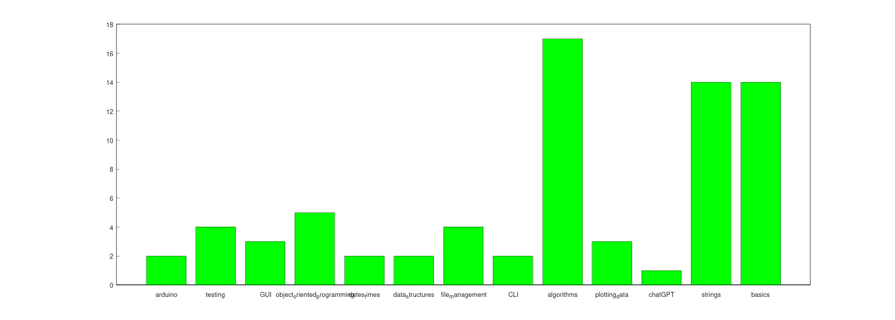

#link:

# Tags
Write a program that will:

- scan recursively a folder structure looking for files named "README.md"
- when one is found, read the file and search for a tags section identified by a line that starts by the string `#tags:`
- scan the rest of the file and return the list of tags selected. Markdown for a ticked list item is:  `- [x]`
- some tags have explanatory details after `:` which should be discarded
- build a list of projects with each element containing the following properties:
  - `std::string Name`: project name from the project folder
  - `std::filesystem::path Path`: the absolute path to the project folder
  - `int Day`: number of the day in the `#100DaysOfCode `challenge when the project was finished, from the parent folder
  - `std::string Date`: corresponding date, from the parent folder
  - `std::vector<std::string> Tags` the list of tags from the `README.md` file

* Count the running total of tags of each kind and plot a bar chart showing the progress

## Resources 

* https://stackoverflow.com/questions/612097/how-can-i-get-the-list-of-files-in-a-directory-using-c-or-c
* https://www.boost.org/doc/libs/1_82_0/libs/filesystem/doc/tutorial.html
* Counter: https://stackoverflow.com/a/62518678/15472802

## Output

See: [output.txt](./output.txt)

## To do

- [ ] fix labels (shorten, camelCase)
- [ ] fix aspect ratio, 
- [ ] fix orientation and size of text labels 
- [ ] add labels with numbers
- [ ] show also add tags with 0 count

# Tags
#tags: 

- [ ] basics
- [ ] algorithms
- [ ] data_structures: trees, graphs
- [x] strings: regex
- [ ] dates_times: timezones
- [x] file_management: input, output, folders and files
- [ ] testing
- [ ] exceptions
- [ ] logging
- [ ] object_oriented_programming
- [ ] GUI
- [x] plotting_data
- [ ] CLI
- [ ] arduino
- [ ] ROS
- [ ] AI_tools: chat GPT
- [ ] databases
- [ ] API
- [ ] web_scraping
- [ ] OpenCV