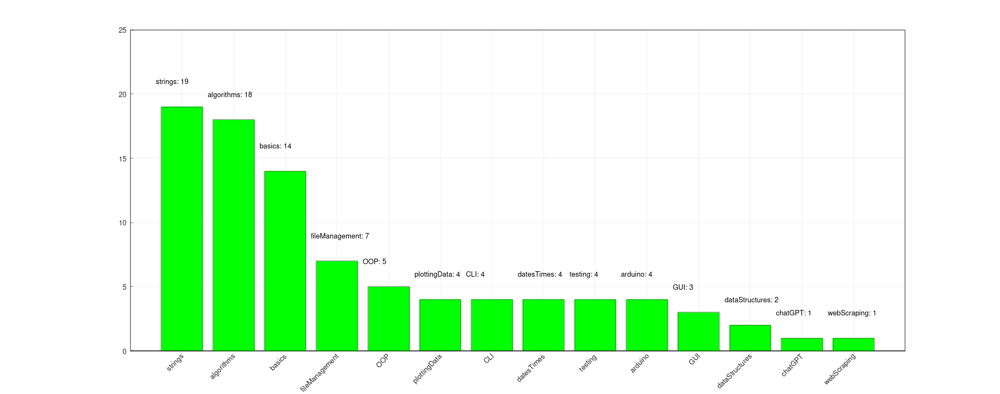

#link:

# BetterTags
Improve the graphical representation of the tags information obtained in the project [Tags](https://github.com/mhered/cpp_100daysofcode/blob/main/code/Day028_23-04-23/Tags)

- [x] fix labels (shorten, camelCase)
- [x] fix orientation and size of text labels 
- [x] add labels with numbers
- [x] sort by label or by most frequent: https://stackoverflow.com/questions/17074324/how-can-i-sort-two-vectors-in-the-same-way-with-criteria-that-uses-only-one-of
- [ ] show also add tags with 0 count
- [ ] fix aspect ratio of the graph

# Tags
#tags: 

- [ ] basics
- [ ] algorithms
- [ ] data_structures: trees, graphs
- [x] strings: regex
- [ ] dates_times: timezones
- [ ] file_management: input, output, folders and files
- [ ] testing
- [ ] exceptions
- [ ] logging
- [ ] object_oriented_programming
- [ ] GUI
- [x] plotting_data
- [ ] CLI
- [ ] arduino
- [ ] ROS
- [ ] chatGPT
- [ ] databases
- [ ] API
- [ ] web_scraping
- [ ] OpenCV