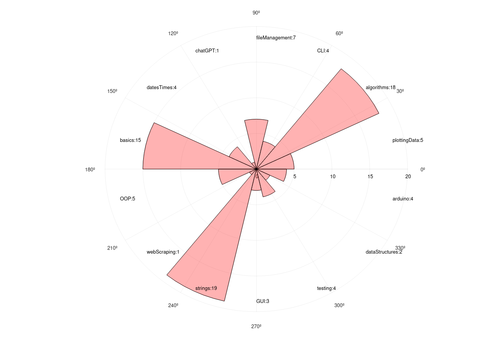

#link:

# Polar Histogram
Modify the representation of tags built for [BetterTags](https://github.com/mhered/cpp_100daysofcode/blob/main/code/Day036_01-05-23/BetterTags) to show a polar histogram (pseudo spider web graph)

# Tags
#tags: 

- [ ] basics
- [ ] algorithms
- [ ] data_structures: trees, graphs
- [ ] strings: regex
- [ ] dates_times: timezones
- [ ] file_management: input, output, folders and files
- [ ] testing
- [ ] exceptions
- [ ] logging
- [ ] object_oriented_programming
- [ ] GUI
- [x] plotting_data
- [ ] CLI
- [ ] arduino
- [ ] ROS
- [ ] AI_tools: chat GPT
- [ ] databases
- [ ] API
- [ ] web_scraping
- [ ] OpenCV