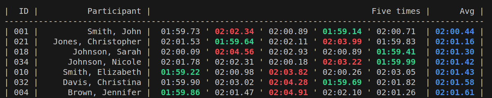

#link: https://live.worldcubeassociation.org/competitions/2634/rounds/36520/projector

# Rubik's Cube Competition

## Using ChatGPT to generate mock data:

Prompt:

```
hello can you generate a list of random data with the following format: 
ID, Name, Last Name, and 5 times in the format minutes:seconds.milliseconds where the times must be random numbers between 06:00.00 and 02:59:99
-
Thank you. Can you repeat but this time for line choose five times such that 1) their average is a random time between 06:00.00 and 02:59.99. 2) the dispersion of the 5 times is lower than 10 seconds 3) all 5 times  between 06:00.00 and 02:59.99 
- 
perfect can you show me 50 more records and using , as separator instead of |  
-
hello can you repeat the previous table but without the last column Average Time?
```

ChatGPT response (saved in file [data.txt](./data.txt)):

```
ID,Name,Last Name,Time 1,Time 2,Time 3,Time 4,Time 5

1,John,Smith,01:59.73,02:02.34,02:00.89,01:59.14,02:00.71
2,Mary,Johnson,02:06.27,02:04.55,02:01.42,02:04.01,02:03.14
3,Michael,Williams,02:08.67,02:02.99,01:59.26,02:05.93,02:03.09
4,Jennifer,Brown,01:59.86,02:01.47,02:04.91,02:02.10,02:01.26
5,James,Jones,02:06.14,02:03.22,01:59.39,02:02.71,02:05.93
...
```

## Tasks
- [x] read a CSV file with participants in a Rubik's cube competition, their ID, name, surname and 5 times
- [x] calculate average time discarding best and worst time
- [x] print a table with a header, sorted by average time, highlighting for each participant the best time in green, the worst time in red, and showing also the average in blue, see example below.

## To do
- [ ] modify mock data to add a wider range of times between 0:07.00 and 3:30.00
- [ ] add DNF and process them (one is excluded from calculation, >=2 result in DNF)
- [ ] testing with DNF, repeated values etc.

```
|  ID |          Participant |                                             Five times |      Avg |
--------------------------------------------------------------------------------------------------
| 001 |          Smith, John |  01:59.73 ' 02:02.34 ' 02:00.89 ' 01:59.14 ' 02:00.71  | 02:00.44 |
| 021 |   Jones, Christopher |  02:01.53 ' 01:59.64 ' 02:02.11 ' 02:03.99 ' 01:59.83  | 02:01.16 |
| 018 |       Johnson, Sarah |  02:00.09 ' 02:04.56 ' 02:02.93 ' 02:00.89 ' 01:59.41  | 02:01.30 |
| 034 |      Johnson, Nicole |  02:01.78 ' 02:02.31 ' 02:00.18 ' 02:03.22 ' 01:59.99  | 02:01.42 |
| 010 |     Smith, Elizabeth |  01:59.22 ' 02:00.98 ' 02:03.82 ' 02:00.26 ' 02:03.05  | 02:01.43 |
| 032 |     Davis, Christina |  01:59.90 ' 02:03.02 ' 02:04.28 ' 01:59.69 ' 02:01.82  | 02:01.58 |
| 004 |      Brown, Jennifer |  01:59.86 ' 02:01.47 ' 02:04.91 ' 02:02.10 ' 02:01.26  | 02:01.61 |
```


# Tags
#tags: 

- [x] basics
- [x] algorithms
- [ ] data_structures: trees, graphs
- [x] strings: regex
- [ ] dates_times: timezones
- [x] file_management: input, output, folders and files
- [ ] testing
- [ ] exceptions
- [ ] logging
- [ ] object_oriented_programming
- [ ] GUI
- [ ] plotting_data
- [ ] CLI
- [ ] arduino
- [ ] ROS
- [x] AI_tools: chat GPT
- [ ] databases
- [ ] API
- [ ] web_scraping
- [ ] OpenCV