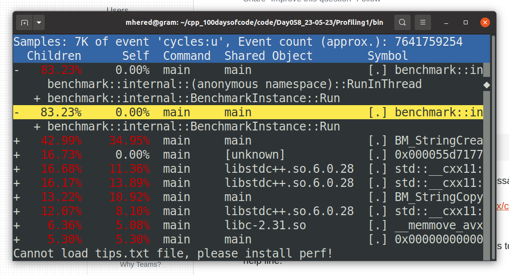

#link: https://www.youtube.com/watch?v=nXaxk27zwlk

# Profiling

I watched the talk "Tuning C++ for Performance" by Chandler Carruth (@chandlerc1024) at CppCon 2015 (link above).

Performance matters because of electricity

Which C++ code to tune? Measure first and tune what matters

For macro benchmarks he refers to the talk "Benchmarking C++ Code" by Bryce Adelstein Lelbach at CppCon 2015: https://www.youtube.com/watch?v=zWxSZcpeS8Q

Micro benchmarks: google/benchmark library: https://github.com/google/benchmark

After watching the whole video, I may have bitten more than I am ready to chew, but at least I will try to install, configure and test the tools he discusses `google/benchmark` and `perf`.

## Installating and configuring `google/benchmark`
See: https://github.com/google/benchmark#installation

* Installation:
```bash
$ cd 
$ git clone https://github.com/google/benchmark.git
$ cd benchmark
$ cmake -E make_directory "build"
$ cmake -E chdir "build" cmake -DBENCHMARK_DOWNLOAD_DEPENDENCIES=on -DCMAKE_BUILD_TYPE=Release ../
$ cmake --build "build" --config Release
```
* Configuration:
The header `benchmark.h` is in `~/git/benchmark/include/benchmark`
libraries `libbenchmark.a`, `libbenchmark_main.a` are in `~/git/benchmark/build/src/` 
Note: compilation needs also at least `cpp11` a link to `libpthread.a`

Create symlink / copy to `/usr/local` so vscode finds headers and libraries:
```bash
$ sudo ln -s ~/git/benchmark/include/benchmark /usr/local/include/benchmark
$ sudo cp ~/git/benchmark/build/src/libbenchmark.a /usr/local/lib/libbenchmark.a
```

* Add `"/usr/local/include/benchmark/**"` to `"includePath": [` in `c_cpp_properties.json` 

* In `tasks.json` set:
```json
"args": [
                "-std=c++11",
                "-fdiagnostics-color=always",
                "-I${fileDirname}",
                "-g",
                "${fileDirname}/*.cpp",
                "-o",
                "${fileDirname}/bin/${fileBasenameNoExtension}",
                "-lbenchmark",
                "-lpthread"
```

* Hello world:
```c++
#include <benchmark/benchmark.h>

static void BM_StringCreation(benchmark::State& state) {
  for (auto _ : state)
    std::string empty_string;
}
// Register the function as a benchmark
BENCHMARK(BM_StringCreation);

// Define another benchmark
static void BM_StringCopy(benchmark::State& state) {
  std::string x = "hello";
  for (auto _ : state)
    std::string copy(x);
}
BENCHMARK(BM_StringCopy);

BENCHMARK_MAIN();
```

Output:
```
2023-05-24T14:22:16+02:00
Running ~/cpp_100daysofcode/code/Day058_23-05-23/Profiling/bin/main
Run on (8 X 4700 MHz CPU s)
CPU Caches:
  L1 Data 48 KiB (x4)
  L1 Instruction 32 KiB (x4)
  L2 Unified 1280 KiB (x4)
  L3 Unified 12288 KiB (x1)
Load Average: 1.28, 1.02, 0.99
***WARNING*** CPU scaling is enabled, the benchmark real time measurements may be noisy and will incur extra overhead.
------------------------------------------------------------
Benchmark                  Time             CPU   Iterations
------------------------------------------------------------
BM_StringCreation       3.83 ns         3.83 ns    189216490
BM_StringCopy           8.33 ns         8.32 ns     83648170
```
## Installing and running `perf`
I tried 3 times unsuccessfully before installation of the proper version of `perf` actually succeeded:
```bash
$ sudo apt install linux-tools-common
$ sudo apt install linux-tools-generic
$ sudo apt install linux-tools-5.15.0-72-generic
```

Then I got this message:
```bash
$ perf record -g ./main
Error:
Access to performance monitoring and observability operations is limited.
Consider adjusting /proc/sys/kernel/perf_event_paranoid setting to open
access to performance monitoring and observability operations for processes
without CAP_PERFMON, CAP_SYS_PTRACE or CAP_SYS_ADMIN Linux capability.
More information can be found at 'Perf events and tool security' document:
https://www.kernel.org/doc/html/latest/admin-guide/perf-security.html
perf_event_paranoid setting is 4:
  -1: Allow use of (almost) all events by all users
      Ignore mlock limit after perf_event_mlock_kb without CAP_IPC_LOCK
>= 0: Disallow raw and ftrace function tracepoint access
>= 1: Disallow CPU event access
>= 2: Disallow kernel profiling
To make the adjusted perf_event_paranoid setting permanent preserve it
in /etc/sysctl.conf (e.g. kernel.perf_event_paranoid = <setting>)
```

To modify `perf_event_paranoid` (see https://superuser.com/questions/980632/run-perf-without-root-rights)

```bash
$ sudo sysctl -w kernel.perf_event_paranoid=3
[sudo] password for mhered: 
kernel.perf_event_paranoid = 3
```
Note1: changin to level 3 is enough although not documented in the message, see this: https://askubuntu.com/questions/1400874/what-does-perf-paranoia-level-four-do
Note: this lasts the terminal session, see the link above to make it permannent.

Then:

```bash
$ perf record -g ./main
2023-05-24T14:56:23+02:00
Running ./main
Run on (8 X 4700 MHz CPU s)
CPU Caches:
  L1 Data 48 KiB (x4)
  L1 Instruction 32 KiB (x4)
  L2 Unified 1280 KiB (x4)
  L3 Unified 12288 KiB (x1)
Load Average: 0.77, 0.97, 1.10
***WARNING*** CPU scaling is enabled, the benchmark real time measurements may be noisy and will incur extra overhead.
------------------------------------------------------------
Benchmark                  Time             CPU   Iterations
------------------------------------------------------------
BM_StringCreation       3.87 ns         3.86 ns    185683730
BM_StringCopy           8.24 ns         8.24 ns     84433631
[ perf record: Woken up 3 times to write data ]
[ perf record: Captured and wrote 0.581 MB perf.data (7728 samples) ]
```

```bash
$ perf report -g "graph,0.5,caller"
```
Result


## To do
- [ ] Check out [How to Use Perf Performance Analysis Tool on Ubuntu 20.04](https://www.howtoforge.com/how-to-install-perf-performance-analysis-tool-on-ubuntu-20-04/)
# Tags
#tags: 

- [ ] basics
- [ ] algorithms
- [ ] data_structures: trees, graphs
- [ ] strings: regex
- [ ] dates_times: timezones
- [ ] file_management: input, output, folders and files
- [ ] testing
- [ ] exceptions
- [ ] logging
- [ ] object_oriented_programming
- [ ] GUI
- [ ] plotting_data
- [ ] CLI
- [ ] arduino
- [ ] ROS
- [ ] AI_tools: chat GPT
- [ ] databases
- [ ] API
- [ ] web_scraping
- [ ] OpenCV
- [x] profiling