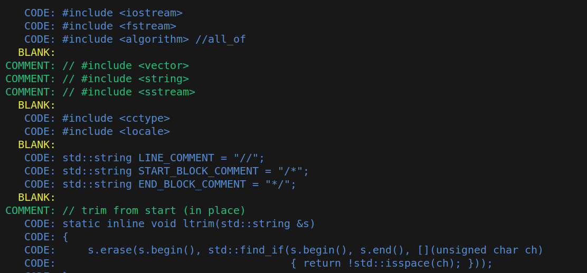
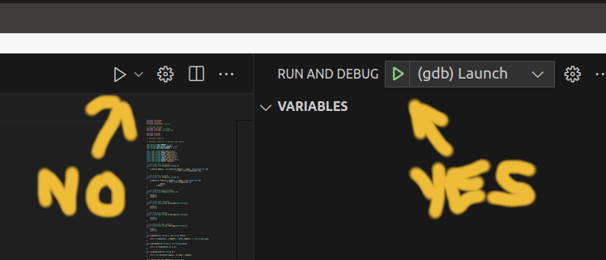

#link: https://en.wikipedia.org/wiki/Source_lines_of_code

# Lines of Code
Write a script that will take as parameters:
- a string `filename` withthe path to a text file containing C++ code
- an optional flag `--verbose` to produce verbose output

The script will read the file `filename`:
- count and print the number of blank lines, comment lines and code lines:

```bash
$ ./main test.cpp 

Total lines of code: 200
of which: 
145 code lines
24 comment lines
31 blank lines
```

- with `--verbose` flag print the content of the file highlighting the blank lines inyllow, coment lines in green and code lines in blue 

Verbose output example:


## Debugging code with command line parameters in vscode 

- add parameters to `args` in `launch.json`: `            "args": ["test.cpp", "--verbose"],`
- Note that the usual Run/Debug icon does not read `launch.json`, you need to use the green icon under Run and Debug menu (Ctrl+Shift+D)

- Again the green icon does not seem to compile... so the complete process seems to be to use the normal icon to recompile after a modification and the green one to execute
- This allows to debug code in vscode feeding it command line parameters
More info in: https://code.visualstudio.com/docs/cpp/launch-json-reference
## Colorizing output

- Note: I tried the `colors.h` header but does not seem to work well with variables, so in the end I commented it out

# Tags
#tags: 

- [x] basics
- [ ] algorithms
- [ ] data_structures: trees, graphs
- [x] strings: regex
- [ ] dates_times: timezones
- [x] file_management: input, output, folders and files
- [ ] testing
- [ ] exceptions
- [ ] logging
- [ ] object_oriented_programming
- [ ] GUI
- [ ] plotting_data
- [ ] CLI
- [ ] arduino
- [ ] ROS
- [ ] AI_tools: chat GPT
- [ ] databases
- [ ] API
- [ ] web_scraping
- [ ] OpenCV
- [x] debugging