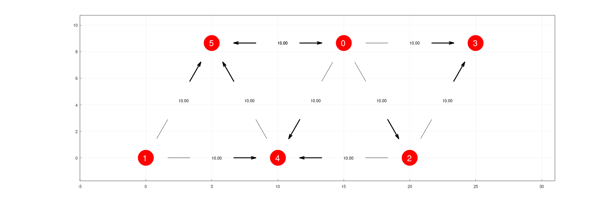
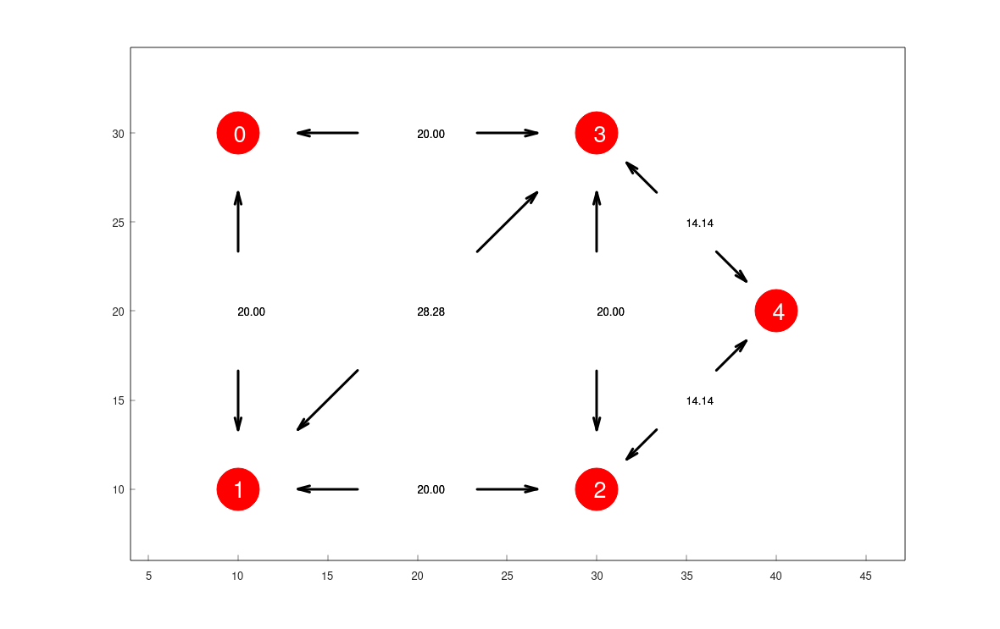
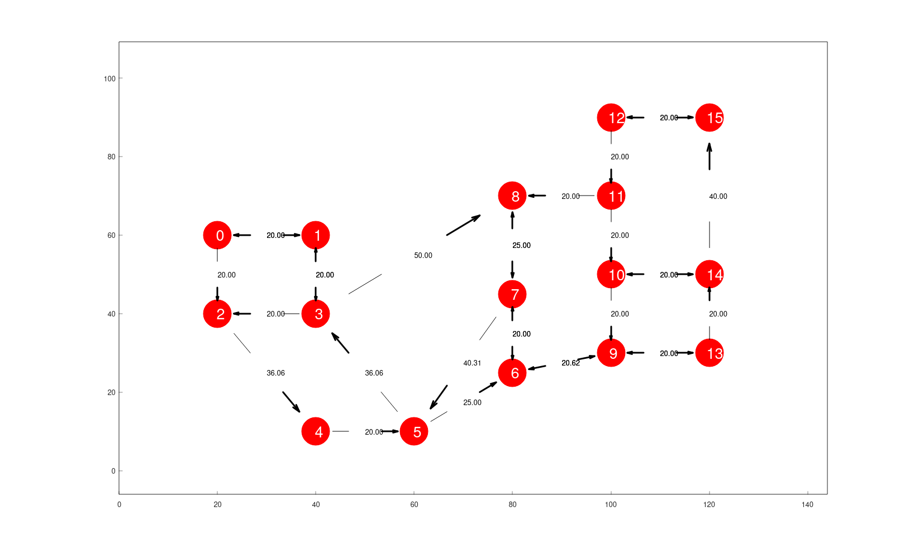

#link:

# Graph plot
Write a function `void PlotGraph(std::vector<std::vector<double>> NodeCoordinates, std::vector<std::vector<bool>> Adjacency)` that plots a weighted, directed graph upon receiving as input a list of the coordinates (x,y) for N nodes and the corresponding N by N adjacency matrix where `Adjacency[i][j] = true` if there is an edge from Node i to Node j. Display also the weights of the edges, computed as the distance between nodes. 

## Example 1

* Input:

```c++
   NodeCoordinates = {
        {15.0, 8.6603}, // Node 0
        {0.0, 0.0},     // Node 1
        {20.0, 0.0},    // Node 2
        {25.0, 8.6603}, // Node 3
        {10.0, 0.0},    // Node 4
        {5.0, 8.6603}}; // Node 5

    Adjacency = {
        {0, 0, 1, 1, 1, 1},  // Node 0
        {0, 0, 0, 0, 1, 1},  // Node 1
        {0, 0, 0, 1, 1, 0},  // Node 2
        {0, 0, 0, 0, 0, 0},  // Node 3
        {0, 0, 0, 0, 0, 1},  // Node 4
        {1, 0, 0, 0, 0, 0}}; // Node 5
```
* Output:
  

## Example 2 

* Input:

```c++
   NodeCoordinates = {
        {10.0, 30.0}, // Node 0
        {10.0, 10.0}, // Node 1
        {30.0, 10.0}, // Node 2
        {30.0, 30.0}, // Node 3
        {40.0, 20.0}, // Node 4
    };

    Adjacency = {
        {1, 1, 0, 1, 0},  // Node 0
        {1, 1, 1, 1, 0},  // Node 1
        {0, 1, 1, 1, 1},  // Node 2
        {1, 1, 1, 1, 1},  // Node 3
        {0, 0, 1, 1, 1}}; // Node 4
```

Output:



## Example 3 

* Input:

```c++
   NodeCoordinates = {
        {10.0, 60.0},  // Node 00
        {20.0, 60.0},  // Node 01
        {10.0, 40.0},  // Node 02
        {20.0, 40.0},  // Node 03
        {20.0, 10.0},  // Node 04
        {30.0, 10.0},  // Node 05
        {40.0, 25.0},  // Node 06
        {40.0, 45.0},  // Node 07
        {40.0, 70.0},  // Node 08
        {50.0, 30.0},  // Node 09
        {50.0, 50.0},  // Node 10
        {50.0, 70.0},  // Node 11
        {50.0, 90.0},  // Node 12
        {60.0, 30.0},  // Node 13
        {60.0, 50.0},  // Node 14
        {60.0, 90.0}}; // Node 15

    Adjacency = {
        {1, 1, 1, 0, 0, 0, 0, 0, 0, 0, 0, 0, 0, 0, 0, 0}, // Node 00
        {1, 1, 0, 1, 0, 0, 0, 0, 0, 0, 0, 0, 0, 0, 0, 0}, // Node 01
        {0, 0, 1, 0, 1, 0, 0, 0, 0, 0, 0, 0, 0, 0, 0, 0}, // Node 02
        {0, 1, 1, 1, 0, 0, 0, 0, 1, 0, 0, 0, 0, 0, 0, 0}, // Node 03
        {0, 0, 0, 0, 1, 1, 0, 0, 0, 0, 0, 0, 0, 0, 0, 0}, // Node 04
        {0, 0, 0, 1, 0, 1, 1, 0, 0, 0, 0, 0, 0, 0, 0, 0}, // Node 05
        {0, 0, 0, 0, 0, 0, 1, 1, 0, 1, 0, 0, 0, 0, 0, 0}, // Node 06
        {0, 0, 0, 0, 0, 1, 1, 1, 1, 0, 0, 0, 0, 0, 0, 0}, // Node 07
        {0, 0, 0, 0, 0, 0, 0, 1, 1, 0, 0, 0, 0, 0, 0, 0}, // Node 08
        {0, 0, 0, 0, 0, 0, 1, 0, 0, 1, 0, 0, 0, 1, 0, 0}, // Node 09
        {0, 0, 0, 0, 0, 0, 0, 0, 0, 1, 1, 0, 0, 0, 1, 0}, // Node 10
        {0, 0, 0, 0, 0, 0, 0, 0, 1, 0, 1, 1, 0, 0, 0, 0}, // Node 11
        {0, 0, 0, 0, 0, 0, 0, 0, 0, 0, 0, 1, 1, 0, 0, 1}, // Node 12
        {0, 0, 0, 0, 0, 0, 0, 0, 0, 1, 0, 0, 0, 1, 1, 0}, // Node 13
        {0, 0, 0, 0, 0, 0, 0, 0, 0, 0, 1, 0, 0, 0, 1, 1}, // Node 14
        {0, 0, 0, 0, 0, 0, 0, 0, 0, 0, 0, 0, 1, 0, 0, 1}, // Node 15
    };
```

Output:




# Tags

#tags: 

- [ ] basics
- [ ] algorithms
- [x] data_structures: arrays, trees, graphs
- [x] strings: format, manipulation, regex 
- [ ] dates_times: times, dates, time zones
- [ ] file_management: read, write, append, search files and folders
- [ ] testing
- [ ] exceptions
- [ ] logging
- [x] object_oriented_programming
- [ ] GUI
- [x] plotting_data
- [ ] CLI: command line arguments, menus, TUI
- [ ] robotics: arduino, ROS
- [ ] chatGPT
- [ ] databases
- [ ] APIs
- [ ] web_scraping
- [ ] OpenCV