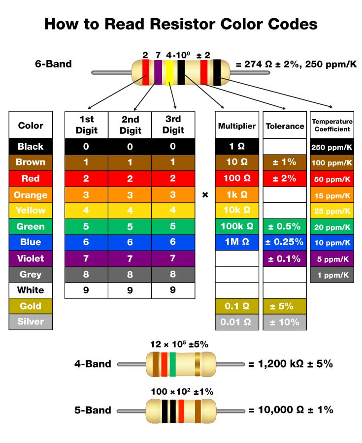

#link: https://edabit.com/challenge/nWBCvjboaxAvqyWSt

# Resistor Color Codes

A resistor is a common electrical component found in every electronic  circuit. Usually a resistor has a color-based code (as painted bands  over it) to decipher through a table.




| Color  | Digits | Magnitude | Tolerance | T.C.R.   |
| ------ | ------ | --------- | --------- | -------- |
| Black  | 0      | 0         | -         | -        |
| Brown  | 1      | 1         | ±1%       | 100ppm/k |
| Red    | 2      | 2         | ±2%       | 50ppm/k  |
| Orange | 3      | 3         | -         | 15ppm/k  |
| Yellow | 4      | 4         | -         | 25ppm/k  |
| Green  | 5      | 5         | ±0.5%     | -        |
| Blue   | 6      | 6         | ±0.25%    | 10ppm/k  |
| Violet | 7      | 7         | ±0.1%     | 5ppm/k   |
| Gray   | 8      | 8         | ±0.05%    | -        |
| White  | 9      | 9         | -         | -        |
| Gold   | -      | -1        | ±5%       | -        |
| Silver | -      | -2        | ±10%      | -        |

Starting from the left assign a number to each coloured band:

- 4 bands resistor:
  - 1st and 2nd color: digits from column 1.
  - 3rd color: 10 elevated to the digit of column 2.
  - 4th color: tolerance from column 3.
- 5 bands resistor:
  - 1st, 2nd and 3rd color: digits from column 1.
  - 4th color: 10 elevated to the digit of column 2.
  - 5th color: tolerance from column 3.
- 6 bands resistor:
  - From 1st to 5th: as above.
  - 6th color: coefficient from column 4.

Then, when numbers have replaced colors:

- **Resistance** is equal to the number resulting by the union of digits from column 1  multiplied for the magnitude calculated from column 2: is measured in  Ohms (symbol: **Ω**). When Ohms are in the thousands order the notation is **kΩ** (*kiloOhms*), in the millions order the notation is **MΩ** (*MegaOhms*), in the billions order the notation is **GΩ** (*GigaOhms*).
- **Tolerance** and **TCR** (temperature coefficient of resistance, only for 6-banded resistors) are the results of columns 3 and 4.

Given an array of colors write a function `std::string resistorCode(std::vector<std::string> colors)` that returns the resistor resistance, tolerance  and (eventually) the TCR as a string (with identifiers separated by  spaces between them).

## Examples

```
resistorCode(["red", "yellow", "blue", "green"]) ➞ "24MΩ ±0.5%"
// red + yellow = 24; blue = 10^6, green = ±0.5%
// resistance * magnitude = 24000000 (24M)

resistorCode(["white", "black", "white", "blue", "gold"]) ➞ "909MΩ ±5%"
// white + black + white = 909

resistorCode(["black", "white", "black", "orange", "red", "yellow"]) ➞ "90kΩ ±2% 25ppm/k"
// black + white + black = 090 = 90; orange = 10^3
// resistance * magnitude = 90000 (90k)
```

## Notes

- For more info about resistors and their color codes check the **Resources** tab.
- All given arrays are valid, no exceptions to handle.

# Tags
#tags: 

- [x] basics
- [ ] algorithms
- [ ] data_structures: trees, graphs
- [x] strings: formatting, regex
- [ ] dates_times: timezones
- [ ] file_management: input, output, folders and files
- [ ] testing
- [ ] exceptions
- [ ] logging
- [ ] object_oriented_programming
- [ ] GUI
- [ ] plotting_data
- [ ] CLI
- [ ] arduino
- [ ] ROS
- [ ] chatGPT
- [ ] databases
- [ ] API
- [ ] web_scraping
- [ ] OpenCV