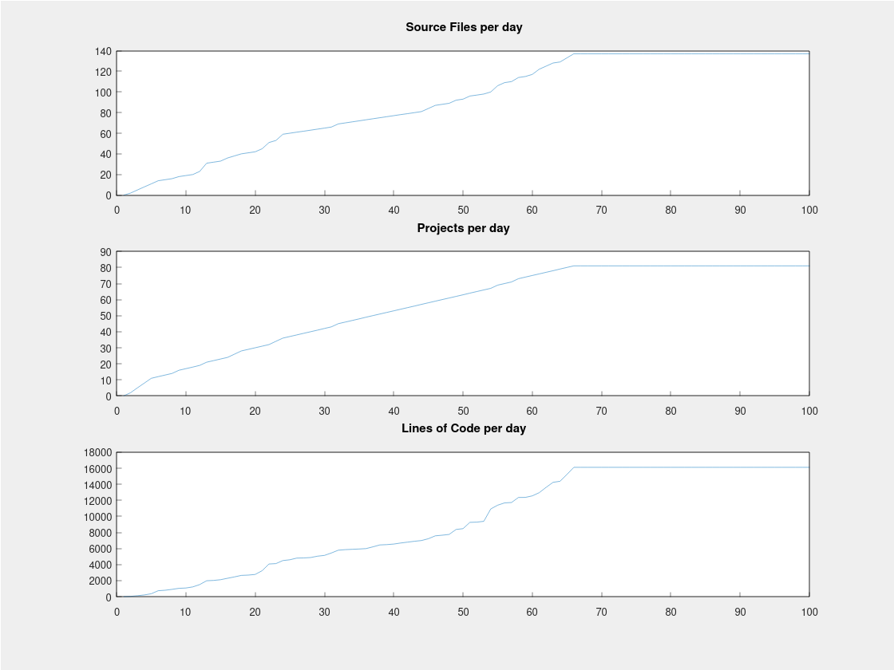

#link:

# Lines of Code Graph
Improve and expant the code in [LinesOfCodeTable](https://github.com/mhered/cpp_100daysofcode/blob/main/code/Day059_24-05-23/LinesOfCodeTable) to scan the #100DaysOfCode repo and create a Markdown table with the daily projects and lines of code written as per the example below (only first few lines shown), as well as a grpah showing number of daily projects, source files and code lines:

```
| Day | Date     | Project           | Lines | Code | Comments | Blank |
| --- | -------- | ----------------- | ----- | ---- | -------- | ----- |
| 1   | 27-03-23 | Burrrrrrrp        | 17    | 14   | 0        | 3     |
| 1   | 27-03-23 | PowerCalculator   | 14    | 11   | 0        | 3     |
| 2   | 28-03-23 | AddNumbers        | 21    | 16   | 0        | 5     |
| 2   | 28-03-23 | FizzBuzz          | 37    | 31   | 0        | 6     |
| 2   | 28-03-23 | RockPaperScissors | 45    | 39   | 0        | 6     |
| 3   | 29-03-23 | CamelToSnake      | 39    | 35   | 0        | 4     |
| 3   | 29-03-23 | ProductOfOthers   | 42    | 34   | 3        | 5     |
| 3   | 29-03-23 | SecondLargest     | 33    | 28   | 0        | 5     |
| 4   | 30-03-23 | FileIO            | 108   | 65   | 23       | 20    |
| 4   | 30-03-23 | Sudoku            | 60    | 49   | 1        | 10    |
...
```

Which results in:

| Day | Date     | Project           | Lines | Code | Comments | Blank |
| --- | -------- | ----------------- | ----- | ---- | -------- | ----- |
| 1   | 27-03-23 | Burrrrrrrp        | 17    | 14   | 0        | 3     |
| 1   | 27-03-23 | PowerCalculator   | 14    | 11   | 0        | 3     |
| 2   | 28-03-23 | AddNumbers        | 21    | 16   | 0        | 5     |
| 2   | 28-03-23 | FizzBuzz          | 37    | 31   | 0        | 6     |
| 2   | 28-03-23 | RockPaperScissors | 45    | 39   | 0        | 6     |
| 3   | 29-03-23 | CamelToSnake      | 39    | 35   | 0        | 4     |
| 3   | 29-03-23 | ProductOfOthers   | 42    | 34   | 3        | 5     |
| 3   | 29-03-23 | SecondLargest     | 33    | 28   | 0        | 5     |
| 4   | 30-03-23 | FileIO            | 108   | 65   | 23       | 20    |
| 4   | 30-03-23 | Sudoku            | 60    | 49   | 1        | 10    |

## Notes

* explore only files with extensions `.h`, `.cpp` , `.hpp`. Added `.ino` for Arduino source files.
* exclude folders named `sandbox`, `bin`. Also `Challenge1` and `Challenge2` template folders.
* Note that in the table there is one line per source file (i.e. if a project has 3 source files, the name of the project will appear in the list 3 times, showing the lines count of each of the files)
* there sems to be a bug in Matplot++: subplots disappear if the figure is resized



# Tags

#tags: 

- [ ] basics
- [ ] algorithms
- [ ] data_structures: trees, graphs
- [x] strings: formatting,  regex
- [ ] dates_times: timezones
- [x] file_management: input, output, folders and files
- [ ] testing
- [ ] exceptions
- [ ] logging
- [ ] object_oriented_programming
- [ ] GUI
- [ ] plotting_data
- [ ] CLI
- [ ] arduino
- [ ] ROS
- [ ] AI_tools: chat GPT
- [ ] databases
- [ ] API
- [ ] web_scraping
- [ ] OpenCV