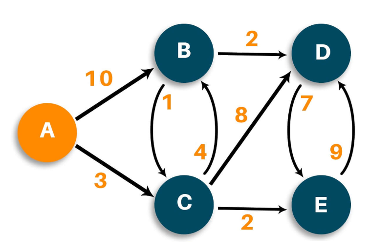

#link: https://favtutor.com/blogs/dijkstras-algorithm-cpp

# Dijkstra Shortest path algorithm

Implement Dijkstra's algorithm for finding the shortest path between two nodes in a weighted graph. This algorithm was conceived by computer scientist Edsger W. Dijkstra in 1956 [Wikipedia](https://en.wikipedia.org/wiki/Dijkstra%27s_algorithm).


Below the pseudocode to implement:

```pseudocode
function Dijkstra(Graph, Source, Target):
    // initialization
    for each node Node in Graph
        dist[Node] <- INFINITY // stores distances from Node to Source
        prev[Node] <- UNDEFINED // stores the previous node to each node visited
        If Node != Source, add Node to Priority Queue Q
    dist[Source] <- 0

    // execution
    while Q is not EMPTY
        U <- node in Q with min dist[U]
        remove U from Q
        if U = Target break
        for each unvisited neighbour K of U
            tempDist <- dist[U] + edgeWeight(U, K)
            if tempDist < dist[K]
                dist[K] <- tempDist
                prev[K] <- U
                
return dist[], prev[]

// reverse iteration to find the shortest path
S <- empty sequence
u <- target
if prev[u] is defined or u = source:    // Do something only if the vertex is reachable
    while u is defined:                 // Construct the shortest path with a stack S
        insert u at the beginning of S  // Push the vertex onto the stack
        u <- prev[u]                    // Traverse from target to source
```

Example:


Expected output when calling `dijkstra(g, 0, 3)`:
```
Creating Graph
0 -> 1 (10) 2 (3) 
1 -> 2 (1) 3 (2) 
2 -> 1 (4) 3 (8) 4 (2) 
3 -> 4 (7) 
4 -> 3 (9) 


Source: 0 Target: 3
|  Nodes   |  Shortest Path                                   |  Distance     |
|----------|--------------------------------------------------|---------------|
|  0 - 0   |  0 -> /                                          |  0            |
|  0 - 1   |  0 -> 2 -> 1 -> /                                |  7            |
|  0 - 2   |  0 -> 2 -> /                                     |  3            |
|  0 - 3   |  0 -> 2 -> 1 -> 3 -> /                           |  9            |
|  0 - 4   |  0 -> 2 -> 4 -> /                                |  5            |
Deleting Graph
```

## Note
  * The function prints all paths calculated until the moment `Target` is removed from the priority queue `Q`. It may be some of the other paths shown are not optimal. E.g. calling `dijkstra(g, 0, 2)` yields:
```
Creating Graph
0 -> 1 (10) 2 (3) 
1 -> 2 (1) 3 (2) 
2 -> 1 (4) 3 (8) 4 (2) 
3 -> 4 (7) 
4 -> 3 (9) 


Source: 0 Target: 2
|  Nodes   |  Shortest Path                                   |  Distance     |
|----------|--------------------------------------------------|---------------|
|  0 - 0   |  0 -> /                                          |  0            |
|  0 - 1   |  0 -> 1 -> /                                     |  10           |
|  0 - 2   |  0 -> 2 -> /                                     |  3            |
|  0 - 3   |  /                                               |  3.40282e+38  |
|  0 - 4   |  /                                               |  3.40282e+38  |
Deleting Graph
```

Where clearly optimal paths to nodes 1, 3, 4 have not been found yet.

## To do
- [ ] refactor to make OOP
- [ ] add support for BMP maps
- [ ] make animation of Dijkstra algorithm


# Tags
#tags: 

- [ ] basics
- [x] algorithms
- [x] data_structures: trees, graphs
- [ ] strings: regex
- [ ] dates_times: timezones
- [ ] file_management: input, output, folders and files
- [ ] testing
- [ ] exceptions
- [ ] logging
- [ ] object_oriented_programming
- [ ] GUI
- [ ] plotting_data
- [ ] CLI
- [ ] arduino
- [ ] ROS
- [ ] chatGPT
- [ ] databases
- [ ] API
- [ ] web_scraping
- [ ] OpenCV