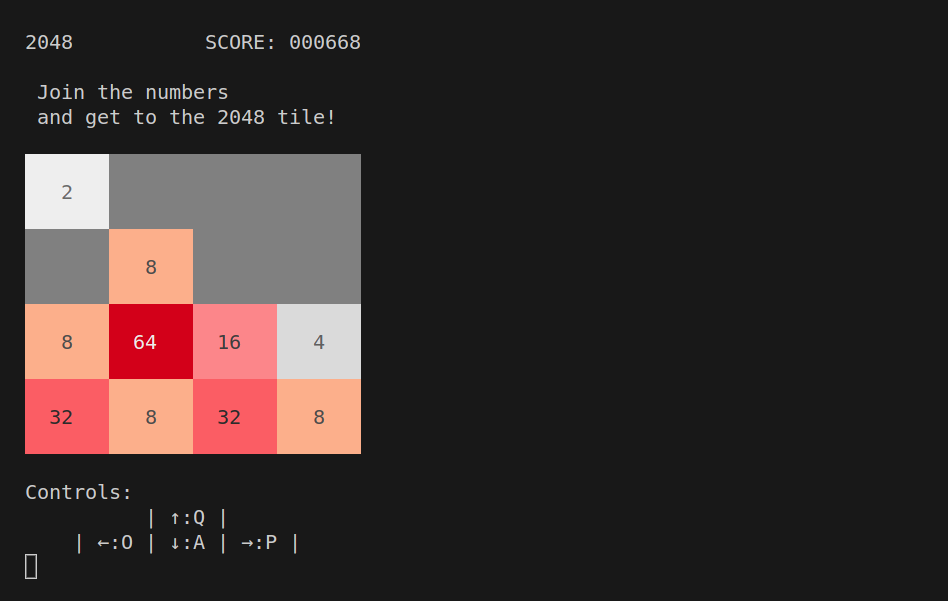

#link: https://play2048.co/

# 2048

Today's project consists in writing a clone of the popular puzzle game 2048 to play in the terminal.

2048 is one of my favorite games. According to [Wikipedia](https://en.wikipedia.org/wiki/2048_(video_game)), this simple yet hugely addictive single-player puzzle game was originally created in 2014 by 19 y.o. Italian web developer Gabriele Cirulli over the course a weekend, and it quickly became viral. See the original github repo (CSS and Javascript): https://github.com/gabrielecirulli/2048.

## Game rules

The player is presented with a 4-by-4 board with numbered tiles, which slide when you swipe the board up/down or left/right. Tiles slide as far as possible in the chosen direction until they are stopped by either another tile or the edge of the grid. 

If two tiles of the same number collide while moving, they merge into a tile with the total value of the two tiles that collided, and the game score increases by the same amount. 

The resulting tile cannot merge with another tile again in the same move, i.e. if a move causes three consecutive tiles of the same value to slide together, only the two tiles at the front will combine. Similarly, if all four spaces in a row or column are filled with tiles of the same value, a move parallel to that row or column will combine the first two and the last two.

After each move, a new tile appears randomly in one of the remaining empty spaces of the board. According to [this source](https://www.baeldung.com/cs/2048-algorithm), 90% of the times the value of the new tile is 2, and the other 10% of the times the value is 4. 

The objective is to keep merging tiles and reach the 2048 tile that lends its name to the game - although one can continue playing beyond this point and create tiles with larger numbers.

The game ends when the player has no legal moves, i.e. there are no empty spaces and no adjacent tiles with the same value.

## Task

* write the code to update the board when it is swiped left/right/up/down: first move tiles together along the chosen direction, then merge adjacent tiles following the rules described above
* Write code to spawn a tile at a random empty position with value 2 or 4.
* Update the game score if there was any tile merging
* Display the updated board and score
* Initialize the board with two tiles at random positions
* See project [Keypress](https://stackoverflow.com/a/63708756/15472802) to write a loop that checks for keypresses and update the board. 
* See project [TexTColors](https://github.com/mhered/cpp_100daysofcode/blob/main/code/Day056_21-05-23/TextColors) for beautiful text formatting at the terminal.

Sample output:

## To do

- [x] start board with two tiles
- [x] randomly add a 4 or a 2. How often? 10% probability of4, 90% of 2 according to https://www.baeldung.com/cs/2048-algorithm
- [ ] fix bug that prevents reaching the game over condition. Check for adjacent tiles?
- [ ] fix seemingly random bug that sometimes causes tiles to disappear

# Tags
#tags: 

- [ ] basics
- [x] algorithms
- [ ] data_structures: trees, graphs
- [x] strings: regex
- [ ] dates_times: timezones
- [ ] file_management: input, output, folders and files
- [ ] testing
- [ ] exceptions
- [ ] logging
- [ ] object_oriented_programming
- [ ] GUI
- [ ] plotting_data
- [x] CLI
- [ ] arduino
- [ ] ROS
- [ ] chatGPT
- [ ] databases
- [ ] API
- [ ] web_scraping
- [ ] OpenCV
- [x] games