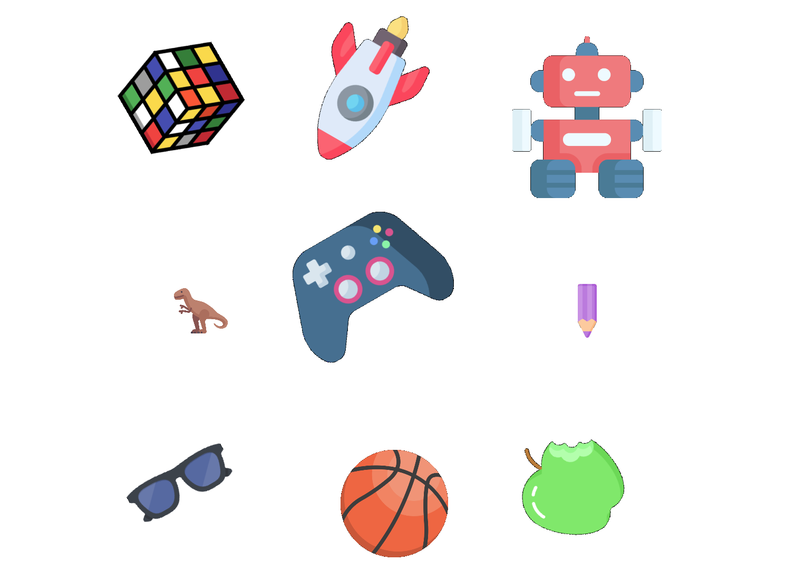

#link: https://stackoverflow.com/questions/22041699/rotate-an-image-without-cropping-in-opencv-in-c/33564950#33564950

# Random Scale, Rotate Translate image

Lets practice scaling, rotating and translating images.

Write a function that will take images in the folder `assets` and overlay them on a 3x3 grid. Each image should have a randomly picked value of scale (small, medium, large), and a randomly picked rotation angle (0 - 330 in 30 degree increments).

Example output:

Credits to [Freepik - Flaticon](https://www.flaticon.com/free-icons/) these 9 beautiful PNG icons.

| | | |
|---|---|---|
||  ||
|  |   ||
|  |  ||

​    
# Tags
#tags: 

- [ ] basics
- [x] algorithms
- [ ] data_structures: trees, graphs
- [ ] strings: regex
- [ ] dates_times: timezones
- [ ] file_management: input, output, folders and files
- [ ] testing
- [ ] exceptions
- [ ] logging
- [ ] object_oriented_programming
- [ ] GUI
- [ ] plotting_data
- [ ] CLI
- [ ] arduino
- [ ] ROS
- [ ] AI_tools: chat GPT
- [ ] databases
- [ ] API
- [ ] web_scraping
- [x] OpenCV