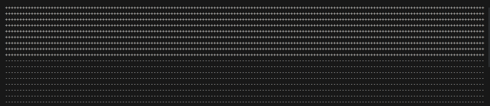
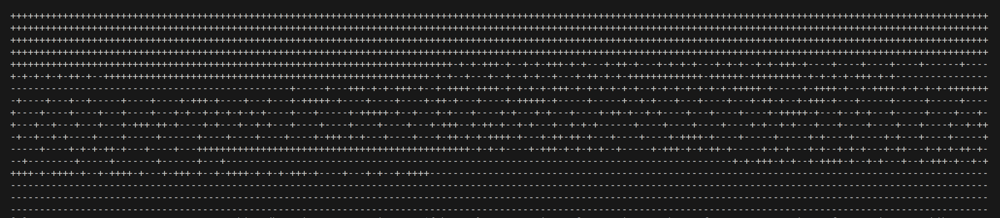

#link: https://m.youtube.com/watch?v=xPqnoB2hjjA

# Multithreading demo

A very basic demo of the behavior and dangers of threads based on the video tutorial of the link above.

Single thread execution is sequential and predictable:

###### 

Multithread execution is faster but order is unpredictable because there is a race condition with shared resource `std::cout`

# Tags

#tags: 

- [x] threads
- [ ] basics
- [ ] algorithms
- [ ] data_structures: trees, graphs
- [ ] strings: regex
- [ ] dates_times: timezones
- [ ] file_management: input, output, folders and files
- [ ] testing
- [ ] exceptions
- [ ] logging
- [ ] object_oriented_programming
- [ ] GUI
- [ ] plotting_data
- [ ] CLI
- [ ] arduino
- [ ] ROS
- [ ] AI_tools: chat GPT
- [ ] databases
- [ ] API
- [ ] web_scraping
- [ ] OpenCV